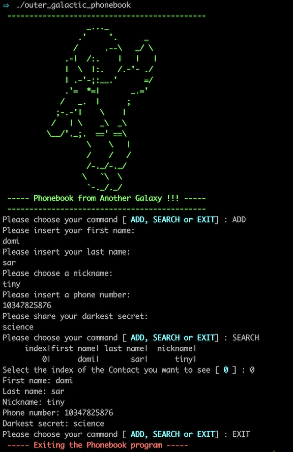

# C++ Modules
Exercises in C++ in order to learn the syntax and understand the specifities of the language when compared to C. The assignments are split in 9 modules and each module has multiple exercises to complete. The subject of each Module (and thus of each exercise) is included in the corresponding folder.

## How to Run the exercises 

In order to run every exercise, you should :

- Clone the current repository.
- Move to the folder of the module and exercise you are interested to run.
- Run the command `make`
- Then run the executable that was generated in the previous step.

For example to run the Phonebook exercise (ex01) of Module 00, you follow the steps (using your terminal) :
```
$ git clone
$ cd Module_00/ex01
$ make
$ ./outer_galactic_phonebook
```

and the result is 

